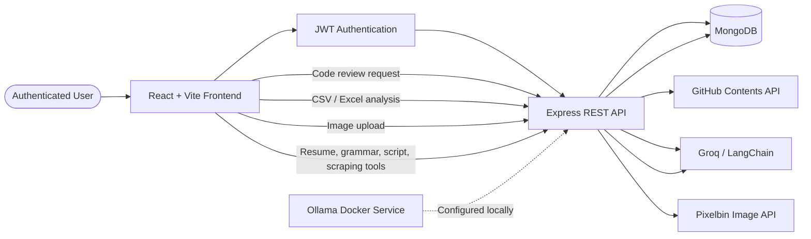

# 🤖 AI-SAAS-APP

### A full-stack AI productivity and development dashboard

[](https://react.dev/)
[](https://www.typescriptlang.org/)
[](https://nodejs.org/)
[](https://expressjs.com/)
[](https://www.mongodb.com/)
[](https://vitejs.dev/)
[](https://tailwindcss.com/)
[](https://docs.docker.com/compose/)

---

## 📌 Overview

**AI-SAAS-APP** is an npm-workspaces monorepo containing a React single-page application and an Express REST API.

The platform provides an authenticated dashboard with AI-oriented tools for software development, productivity, document creation, data analysis, and image processing. User accounts, authentication data, and per-user interaction history are persisted in MongoDB.

Some tools currently use demonstration or simulated responses, while code review and data analysis integrate with Groq-powered services.

---

## ✨ Features

### 🔐 Authentication & Account Management

- User registration and login
- JWT-based authentication
- bcrypt password hashing
- Password peppering using `SECRET_KEY`
- Protected frontend routes
- Profile updates
- Password changes
- Browser token persistence using `localStorage`

### 🧰 Productivity & AI Tools

- GitHub repository code review
- JavaScript-style script generation
- Grammar checking
- CSV and Excel data analysis
- Image watermark removal
- Resume generation
- Web data extraction
- Per-user interaction history
- History listing and deletion

### 🎨 Dashboard Experience

- Responsive authenticated layout
- Sidebar navigation
- Dark theme
- Theme provider
- Toast notifications
- Tool-specific pages and routes
- Markdown rendering and chart support

---

## 🧠 Tool Status

| Tool | Current implementation |
|---|---|
| **GitHub Code Review** | Retrieves repository contents and sends consolidated context to Groq through LangChain |
| **Data Analyst** | Parses CSV/Excel files, counts missing values, and requests insights and chart data from Groq |
| **Watermark Remover** | Uses Pixelbin image processing |
| **Resume Builder** | Returns fixed example-style resume data |
| **Grammar Checker** | Returns a fixed example response |
| **Script Generator** | Returns a simple console-log template |
| **Web Scraper** | Returns fixed example data; a real scrape is not visibly performed |

---

## 🛠️ Tech Stack

### Frontend


Additional frontend libraries include:

- Zod
- Recharts
- React Markdown
- Lucide React
- Sonner
- PostCSS
- Autoprefixer
- ESLint

### Backend


Additional backend libraries and integrations include:

- bcrypt
- Multer
- CORS
- dotenv
- `csv-parser`
- `xlsx`
- `node-fetch`
- Groq SDK
- LangChain Core
- LangChain Groq
- LangChain Ollama
- Pixelbin Admin SDK
- Nodemon

---

## 🗂️ Project Structure

```text
.
├── package.json
├── README.md
├── docker-compose.yml
├── frontend/
│   ├── package.json
│   ├── index.html
│   ├── vite.config.ts
│   ├── tsconfig.json
│   ├── eslint.config.js
│   ├── postcss.config.js
│   ├── tailwind.config.js
│   └── src/
│       ├── main.tsx
│       ├── app/
│       │   ├── App.tsx
│       │   ├── routes.tsx
│       │   ├── components/
│       │   └── pages/
│       ├── context/
│       └── styles/
├── backend/
│   ├── package.json
│   ├── .env.example
│   ├── test-groq.js
│   ├── test-login.js
│   └── src/
│       ├── server.js
│       ├── controllers/
│       ├── middleware/
│       ├── models/
│       ├── repositories/
│       ├── routes/
│       ├── services/
│       └── utils/
└── node_modules/
```

### Important entry points

| Area | File | Responsibility |
|---|---|---|
| Frontend entry | `frontend/src/main.tsx` | Mounts the React application |
| Application shell | `frontend/src/app/App.tsx` | Configures theme, auth provider, routing, and notifications |
| Frontend routes | `frontend/src/app/routes.tsx` | Defines public and protected routes |
| Protected routes | `frontend/src/app/components/auth/ProtectedRoute.tsx` | Redirects unauthenticated users to `/login` |
| Backend entry | `backend/src/server.js` | Loads configuration, connects to MongoDB, registers routes, and starts Express |
| Auth service | `backend/src/services/auth.service.js` | Registration, login, JWT creation, and account updates |
| Auth middleware | `backend/src/middleware/auth.middleware.js` | Validates JWT bearer tokens |
| User model | `backend/src/models/user.model.js` | Defines the MongoDB user schema |
| Code review service | `backend/src/services/codeReviewService.js` | Retrieves GitHub files and requests Groq analysis |
| Data analysis service | `backend/src/services/groq.service.js` | Sends sampled data to Groq and parses insights |
| Image processing | `backend/src/utils/image-processor.js` | Uploads and processes images through Pixelbin |

---

## 🔄 Application Flow



> The supplied code visibly uses Groq for code review and data analysis. Ollama is configured through Docker Compose, but no supplied source file visibly invokes it.

---

## 🚀 Usage

### 1. Install dependencies

From the repository root:

```bash
npm install
```

The repository also provides:

```bash
npm run install-all
```

which runs:

```bash
npm install --workspaces
```

### 2. Configure the backend

An example environment file is provided at:

```text
backend/.env.example
```

The backend expects its environment file at:

```text
backend/.env
```

The repository does not provide an explicit copy command, so create `backend/.env` manually and configure the required values.

| Variable | Purpose |
|---|---|
| `PORT` | Backend HTTP port; defaults to `5000` |
| `MONGODB_URI` | MongoDB connection string |
| `SECRET_KEY` | JWT signing key and bcrypt password pepper |
| `PIXELBIN_CLOUD_NAME` | Pixelbin cloud name |
| `PIXELBIN_API_TOKEN` | Pixelbin API token |
| `GITHUB_TOKEN` | Optional GitHub API token |
| `GROQ_API_KEY` | Groq API key |

### 3. Start the application

Run the frontend and backend together:

```bash
npm run dev
```

Start only the frontend:

```bash
npm run dev --workspace=frontend
```

Start the backend with Nodemon:

```bash
npm run dev --workspace=backend
```

Start the backend without Nodemon:

```bash
npm start --workspace=backend
```

The backend defaults to:

```text
http://localhost:5000
```

### 4. Optional Ollama setup

Start the Docker Compose service:

```bash
docker compose up -d
```

Pull the configured model:

```bash
docker exec ollama ollama pull qwen2.5-coder:1.5b
```

Ollama is exposed on port `11434` and persists model data in the `ollama_data` Docker volume.

---

## 🧪 Build, Test & Lint

### Frontend build

```bash
npm run build --workspace=frontend
```

This executes:

```text
tsc -b && vite build
```

### Frontend preview

```bash
npm run preview
```

### Frontend linting

```bash
npm run lint --workspace=frontend
```

### Standalone utilities

Test registration and login against a running backend:

```bash
node backend/test-login.js
```

Call the Groq data-analysis service with sample data:

```bash
node backend/test-groq.js
```

> No integrated test framework or `test` npm script is configured.

---

## 🔌 API Routes

All protected routes require:

```http
Authorization: Bearer <token>
```

### Public routes

| Method | Endpoint | Description |
|---|---|---|
| `GET` | `/api/health` | Health status and timestamp |
| `POST` | `/api/auth/register` | Create a user account |
| `POST` | `/api/auth/login` | Authenticate and receive a JWT |

### Protected account routes

| Method | Endpoint | Description |
|---|---|---|
| `PUT` | `/api/auth/profile` | Update profile information |
| `PUT` | `/api/auth/change-password` | Change the account password |
| `GET` | `/api/auth/history` | Retrieve user interaction history |
| `DELETE` | `/api/auth/history/:id` | Delete a history entry |

### Protected tool routes

| Method | Endpoint | Input |
|---|---|---|
| `POST` | `/api/watermark/remove` | Multipart image field: `image` |
| `POST` | `/api/data-analyst/analyze` | Multipart file field: `file`; optional `query` |
| `POST` | `/api/resume/generate` | `jobDescription`, `skills`, `summary`, optional `resume` |
| `POST` | `/api/code-review/analyze` | JSON body containing `repoUrl` |
| `POST` | `/api/grammar/check` | JSON body containing `text` |
| `POST` | `/api/script/generate` | JSON body containing `prompt` and `language` |
| `POST` | `/api/scrape/extract` | Form fields: `url` and `selectors` |

Example code-review request:

```json
{
  "repoUrl": "https://github.com/owner/repository"
}
```

---

## 🌐 External APIs, Storage & Assets

### MongoDB

- Accessed with Mongoose
- Connection configured through `MONGODB_URI`
- Stores users and embedded interaction history
- No migration system or database initialization scripts are supplied
- MongoDB must be provided externally; no MongoDB container is included

### GitHub

The code-review service calls:

```text
https://api.github.com/repos/{owner}/{repo}/contents
```

A `GITHUB_TOKEN` may optionally be supplied for repository access.

### Groq

Groq is used for:

- Repository code review through LangChain `ChatGroq`
- CSV/Excel data analysis through the Groq SDK

Configured model:

```text
llama-3.3-70b-versatile
```

### Pixelbin

The watermark-removal flow:

1. Uploads an image to Pixelbin
2. Applies watermark removal with text and logo removal enabled
3. Downloads and returns the processed image as PNG data

### Browser storage

The frontend stores the JWT in browser `localStorage` under:

```text
token
```

### Ollama

- Configured through `docker-compose.yml`
- Exposed on port `11434`
- Uses the `ollama_data` Docker volume
- Installed LangChain Ollama support is not visibly used by the supplied source

---

## 🧭 Frontend Routes

### Public

- `/login`
- `/register`

### Protected

- `/`
- `/code-reviewer`
- `/script-generator`
- `/grammar-checker`
- `/data-analyst`
- `/watermark-remover`
- `/resume-builder`
- `/web-scraper`
- `/history/:model/:id?`
- `/settings`

### Fallback

- `*` renders the not-found page

---

## ⚠️ Known Issues & Limitations

- The root build invokes `npm run build --workspace=backend`, but the backend does not define a `build` script. The root build is therefore expected to fail at the backend step.
- No automated test framework is configured.
- Several tools return fixed or simulated responses rather than fully implemented AI or scraping results.
- The code-review method is named `runMultiAgentReview`, but the visible implementation sends one consolidated request to Groq rather than coordinating multiple Ollama agents.
- MongoDB setup is external; no MongoDB Docker service or initialization script is provided.
- At least one frontend request uses the hardcoded URL `http://localhost:5000/api/auth/history`.
- CORS is enabled globally without a visible origin restriction.
- Exact Node.js and npm version requirements are not specified.
- Production deployment configuration is not provided.
- The complete contents of all frontend pages and context files were not available for full request-flow verification.
- It is not confirmed whether the frontend and backend are intended to be deployed under the same domain.

---

## 📄 License

No license information is provided in the supplied repository analysis.